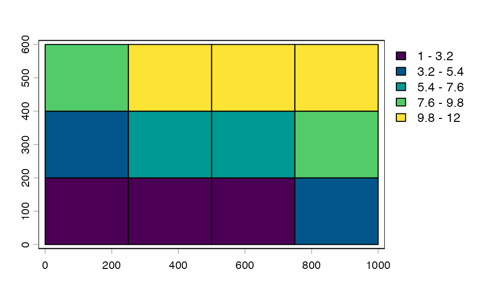
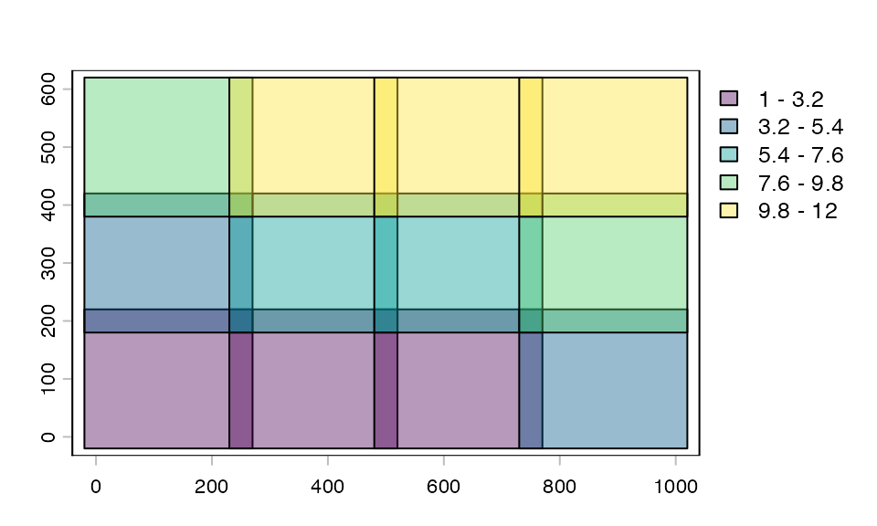
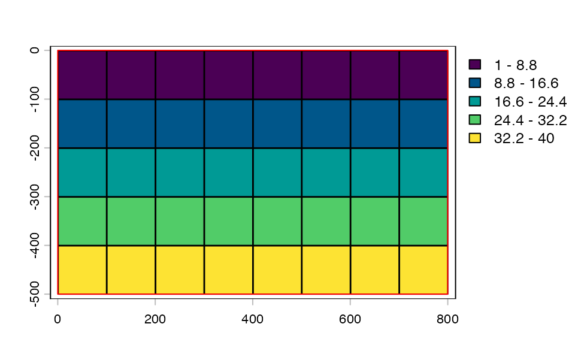
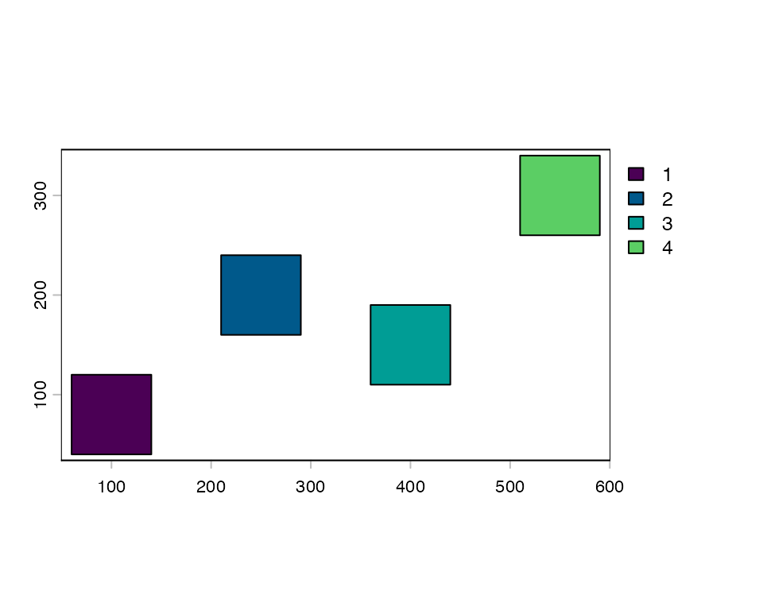
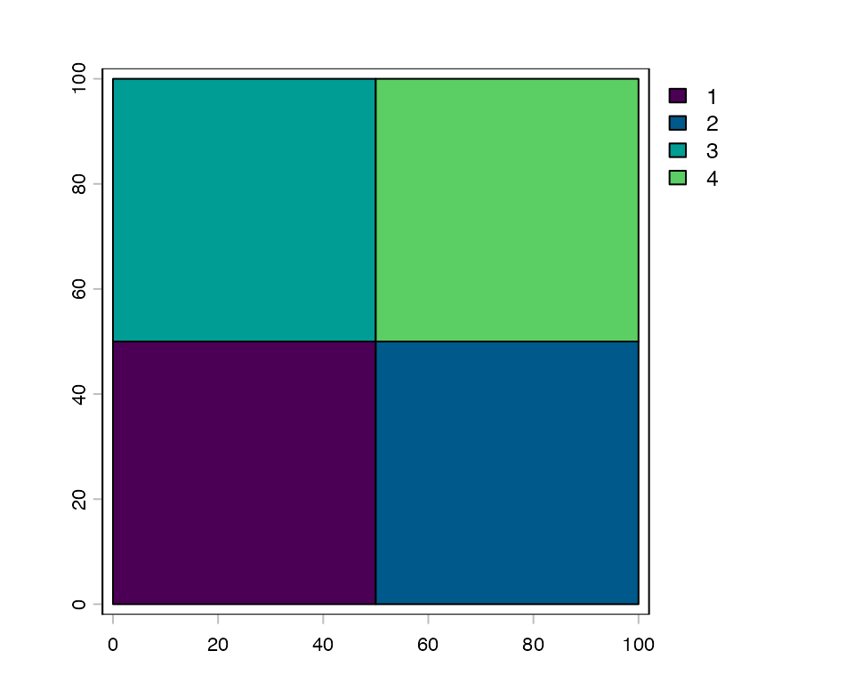
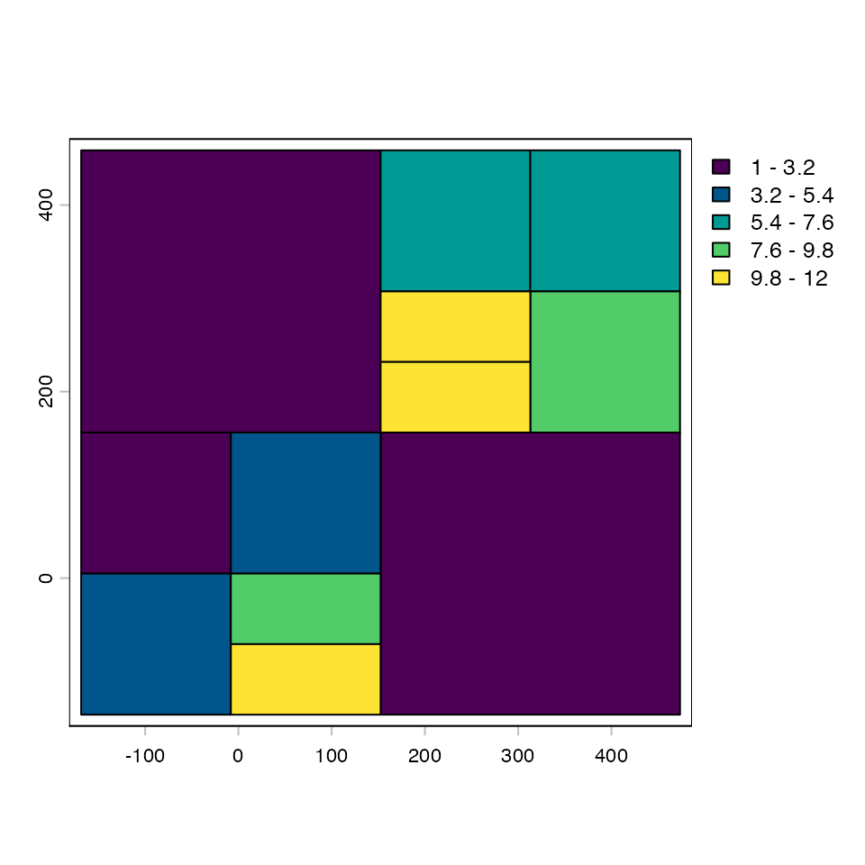
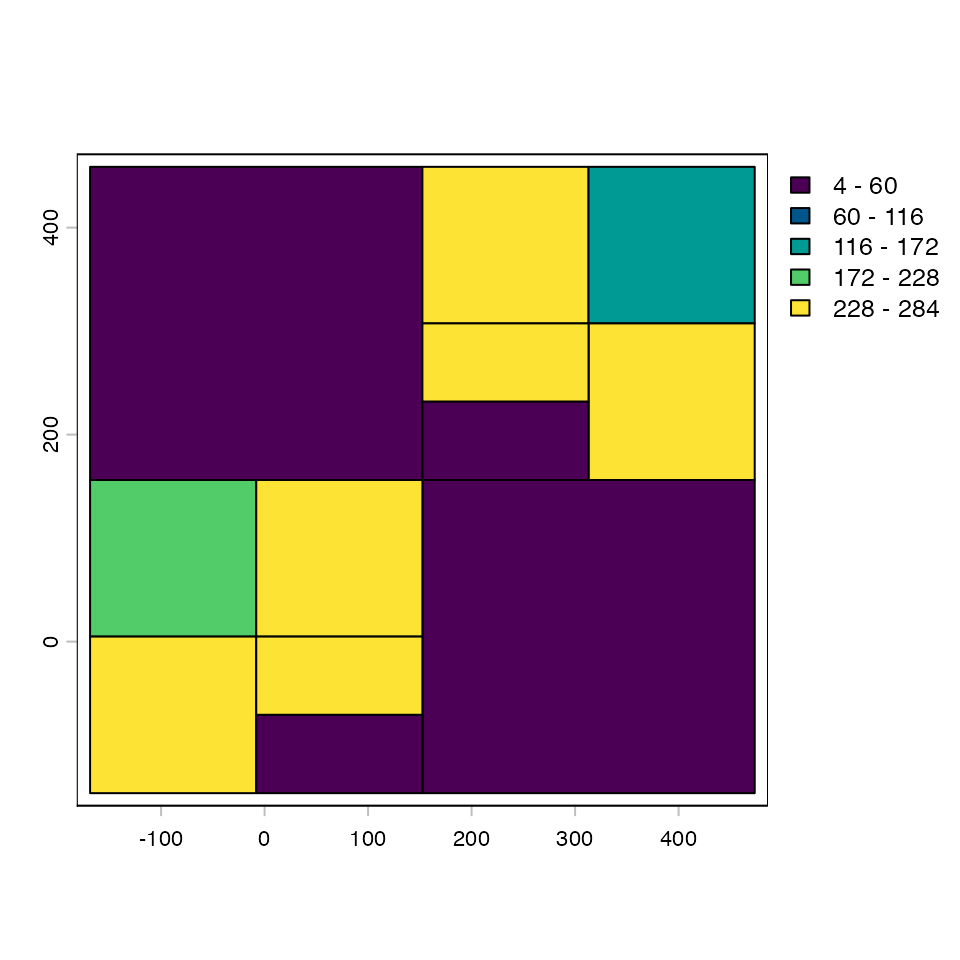
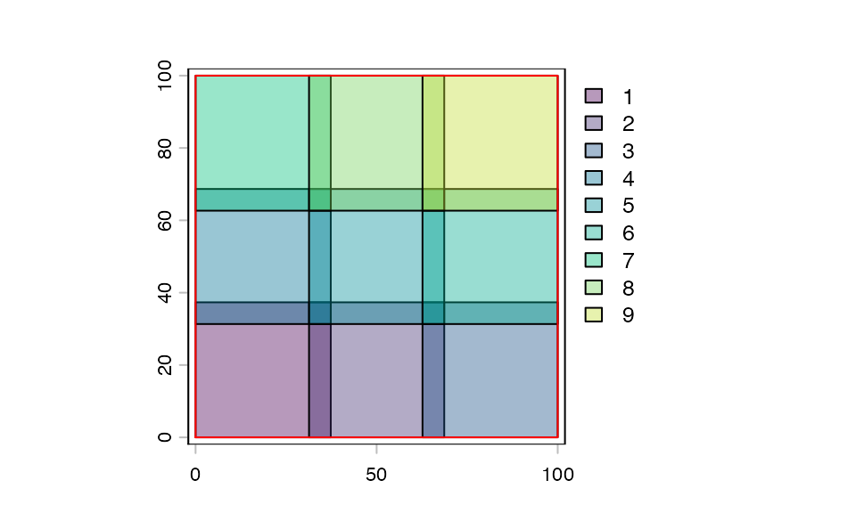

# Choosing and Creating a Tile Plan

``` r
library(tilework)
library(terra)
#> terra 1.9.11
```

## Overview

tilework provides four concrete tile plan classes, each suited to a
different way of thinking about how a dataset should be divided:

| Class | Tile placement | Coordinate system | Returns |
|----|----|----|----|
| `spatialTilePlan` | Uniform grid | CRS units | `SpatExtent` |
| `pixelTilePlan` | Uniform grid | Pixel indices | `integer[4]` |
| `pointTilePlan` | Arbitrary centers | CRS or pixel | `SpatExtent` or `integer[4]` |
| `freeTilePlan` | Explicit per-tile bounds | Inherent to bounds | `SpatExtent` |

The choice between them is usually straightforward:

- Working with **georeferenced rasters or vectors** where coordinates
  are in CRS units? → `spatialTilePlan`
- Working with **images** where pixel position is what matters? →
  `pixelTilePlan`
- Have a **list of locations** (cell centroids, tissue landmarks, sample
  sites) you want to extract fixed-size patches around? →
  `pointTilePlan`
- Need **variable-size tiles** driven by data density or an external
  partitioning algorithm? → `freeTilePlan` (often via
  [`quadtreePlan()`](https://drieslab.github.io/tilework/reference/quadtreePlan.md))

------------------------------------------------------------------------

## `spatialTilePlan`

`spatialTilePlan` divides a spatial extent into a uniform grid. Tile
bounds are returned as `SpatExtent` objects, which route directly into
terra’s spatial windowing operations downstream.

Two things are required: an extent and a tile count request. The actual
number of tiles generated will be at least the requested number,
arranged as squarely as possible given the extent’s aspect ratio.

``` r
tp_spat <- spatialTilePlan(ext = c(0, 1000, 0, 600), n = 12)

tp_spat
#> Object of class spatialTilePlan 
#> extent : 0, 1000, 0, 600 (xmin, xmax, ymin, ymax)
#> dim    : 3 4
#> pad    : 0
dim(tp_spat)   # nrow x ncol of the tile grid
#> [1] 3 4
length(tp_spat)
#> [1] 12
```

``` r
plot(tp_spat)
```



Padding expands each tile’s bounds equally on all four sides at
extraction time. The plan’s own extent is not affected.

``` r
tp_spat_padded <- tp_spat + 20
plot(tp_spat_padded, alpha = 0.4)
```



Indexing returns `SpatExtent` objects:

``` r
tp_spat[1]       # first tile
#> [[1]]
#> SpatExtent : 0, 250, 0, 200 (xmin, xmax, ymin, ymax)
tp_spat[2, 3]    # row 2, col 3
#> [[1]]
#> SpatExtent : 500, 750, 200, 400 (xmin, xmax, ymin, ymax)
```

**When to use:** Any workflow where tile bounds need to be expressed in
the same coordinate system as the data — georeferenced rasters, `sf`
geometries, `SpatVector` objects.

------------------------------------------------------------------------

## `pixelTilePlan`

`pixelTilePlan` divides an image into a uniform grid of pixel-exact
tiles. Bounds are returned as `integer[4]` vectors
`c(xmin, xmax, ymin, ymax)` in pixel index space, routing into
array/matrix subsetting operations downstream.

Three things are required: the image’s pixel dimensions (`pxdims`), and
the tile height and width in pixels (`nrows`, `ncols`).

``` r
tp_px <- pixelTilePlan(pxdims = c(500, 800), nrows = 100, ncols = 100)

tp_px
#> Object of class pixelTilePlan 
#> tiles  : 40
#> pxdim  : 500, 800
#> pxrows : 100
#> pxcol  : 100
#> dim    : 5, 8
#> pad    : 0
dim(tp_px)
#> [1] 5 8
length(tp_px)
#> [1] 40
```

``` r
plot(tp_px)
```



Padding for pixel plans is automatically zeroed against the top-left
corner so that padded tiles on the first row/column do not produce
negative indices.

``` r
tp_px_padded <- tp_px + 5
tp_px_padded[1]   # first tile: note xmin/ymin are still >= 1
#> [[1]]
#> [1]   1 110   1 110
#> attr(,"tile")
#> [1] 1
tp_px[1]          # unpadded for comparison
#> [[1]]
#> [1]   1 100   1 100
#> attr(,"tile")
#> [1] 1
```

**When to use:** Image processing workflows where there is no meaningful
spatial coordinate system — microscopy images, whole slide images,
general computer vision pipelines. Also the right choice when
pixel-exact tile boundaries matter (e.g. ML patch extraction where tile
size must match model input exactly).

------------------------------------------------------------------------

## `pointTilePlan`

`pointTilePlan` places tiles at arbitrary (x, y) centers with a uniform
tile size. Instead of dividing a grid, you provide the locations and the
plan generates one tile per point.

This is the right choice when the locations to sample are known in
advance — cell nuclei, tissue landmarks, sampling sites, feature
centroids — rather than when you want to exhaust a spatial extent.

``` r
tp_pt <- pointTilePlan("spatial",
    coords = cbind(x = c(100, 250, 400, 550), y = c(80, 200, 150, 300)),
    width  = 80,
    height = 80
)

tp_pt
#> Object of class pointTilePlan 
#> input     : spatial
#> output    : spatial
#> n         : 4
#> tile_dims : 80, 80 (height, width)
#> pad       : 0
length(tp_pt)
#> [1] 4
```

``` r
plot(tp_pt)
```



### Coordinate modes: `input` and `output`

`pointTilePlan` has two independent coordinate mode settings:

- **`$input`** — the space in which `$coords`, `$width`, and `$height`
  are expressed. Either `"spatial"` (CRS units) or `"pixel"` (pixel
  indices).
- **`$output`** — the type of bounds returned by
  [`getTile()`](https://drieslab.github.io/tilework/reference/getTile.md).
  Either `"spatial"` (returns `SpatExtent`) or `"pixel"` (returns
  `integer[4]`).

By default `output` matches `input`. Setting them to different values
enables cross-mode conversion.

The four combinations:

| `input` | `output` | Meaning |
|----|----|----|
| `"spatial"` | `"spatial"` | Spatial coords in, spatial bounds out |
| `"pixel"` | `"pixel"` | Pixel coords in, pixel bounds out |
| `"spatial"` | `"pixel"` | Define location in CRS, extract pixel bounds |
| `"pixel"` | `"spatial"` | Define location in pixel space, extract spatial bounds |

### Same-mode: spatial → spatial

The most common case. Coordinates, tile dims, and padding are all in CRS
units. No raster metadata needed.

``` r
tp_s2s <- pointTilePlan(input = "spatial", output = "spatial",
    coords = cbind(x = c(200, 500), y = c(150, 400)),
    width  = 100,
    height = 100
)

tp_s2s[1]  # SpatExtent
#> [[1]]
#> SpatExtent : 150, 250, 100, 200 (xmin, xmax, ymin, ymax)
```

### Same-mode: pixel → pixel

Coordinates and tile dims are in pixel indices. Useful when sampling
locations come from image analysis (e.g. detected cell positions in
pixel space).

``` r
tp_p2p <- pointTilePlan(input = "pixel", output = "pixel",
    coords = cbind(x = c(120L, 340L, 560L), y = c(80L, 200L, 310L)),
    width  = 51L,   # odd dims give unambiguous center pixel
    height = 51L
)

tp_p2p[2]  # integer[4]: col_min, col_max, row_min, row_max
#> [[1]]
#> [1] 315 365 175 225
#> attr(,"tile")
#> [1] 2
#> attr(,"x")
#> [1] 340
#> attr(,"y")
#> [1] 200
```

Note: tile dims should be **odd** in pixel mode. With even dimensions,
`center ± width/2` is non-integer and bounds are truncated, biasing
left/up.

### Cross-mode: spatial → pixel and pixel → spatial

Cross-mode conversion requires knowing how CRS coordinates map to pixel
indices, which means the raster’s resolution and extent must be known.

When
[`getTile()`](https://drieslab.github.io/tilework/reference/getTile.md)
is called with a `SpatRaster`, this information is injected
automatically from the raster — you do not need to set `$rast_dims` or
`$extent` manually. They are only needed for standalone `[i]` calls
without a raster (e.g. plotting, validation).

``` r
f <- system.file("ex/elev.tif", package = "terra")
r <- rast(f)

# spatial input, pixel output
tp_s2p <- pointTilePlan(input = "spatial", output = "pixel",
    coords = cbind(x = c(5.8, 6.0, 6.2), y = c(49.9, 50.0, 50.1)),
    width  = 0.1,
    height = 0.1
)

# Standalone [i] requires rast_dims and extent:
tp_s2p$rast_dims <- dim(r)[1:2]
tp_s2p$extent    <- as.vector(ext(r))

tp_s2p[1]  # pixel bounds, derived from spatial coords + raster metadata
#> [[1]]
#> [1]  9  8 36 35
#> attr(,"tile")
#> [1] 1
#> attr(,"x")
#> [1] 5.8
#> attr(,"y")
#> [1] 49.9
```

``` r
# At getTile() time, rast_dims and extent are injected from the raster
# automatically — no manual setup needed for the extraction step:
tiles <- getTile(r, tp_s2p, i = 1:3)
dim(tiles[[1]])
#> [1] 2 2 1
```

------------------------------------------------------------------------

## `freeTilePlan` and `quadtreePlan`

`freeTilePlan` stores explicit per-tile bounds as an n × 4 matrix
(`xmin, xmax, ymin, ymax`). Unlike the grid-based plans, tile sizes can
vary freely — bounds are the canonical representation, not a formula.

The simplest use is to supply bounds directly:

``` r
tp_free <- freeTilePlan()
tp_free$bounds <- rbind(
    c(0,  50,  0,  50),
    c(50, 100, 0,  50),
    c(0,  50,  50, 100),
    c(50, 100, 50, 100)
)

tp_free
#> Object of class freeTilePlan 
#> n      : 4
#> xrange : [0, 100]
#> yrange : [0, 100]
#> pad    : 0
length(tp_free)
#> [1] 4
tp_free[2]   # SpatExtent
#> [[1]]
#> SpatExtent : 50, 100, 0, 50 (xmin, xmax, ymin, ymax)
```

``` r
plot(tp_free)
```



### Adaptive decomposition with `quadtreePlan()`

The more common workflow is to let
[`quadtreePlan()`](https://drieslab.github.io/tilework/reference/quadtreePlan.md)
build the `freeTilePlan` automatically. It starts from a coarse
`tilePlan`, applies `FUN` to each tile, and recursively splits tiles
whose value exceeds `threshold`. Splitting continues until all tiles are
below the threshold, smaller than `min_tile_size`, or `max_depth` is
reached. After splitting, neighboring leaf tiles whose combined `FUN`
value stays ≤ `threshold` are merged back into a single rectangle,
reducing tile count in sparse regions.

`FUN` must return a single numeric scalar per tile — typically a count,
density, or variance. The last measured value for each leaf is stored in
the `n_records` metadata column.

``` r
# Synthetic two-cluster point cloud
set.seed(42)
pts <- terra::vect(
    cbind(x = rnorm(1000, 0, 50), y = rnorm(1000, 0, 50))
)
pts <- rbind(pts, terra::vect(
    cbind(x = rnorm(1000, 300, 50), y = rnorm(1000, 300, 50))
))

# tileApply requires on-disk data
f_pts <- tempfile(fileext = ".shp")
terra::writeVector(pts, f_pts)
pts_proxy <- terra::vect(f_pts, proxy = TRUE)

# Coarse 2×2 starting grid
tp_start <- spatialTilePlan(ext = ext(pts), n = 4L)
tp_start
#> Object of class spatialTilePlan 
#> extent : -168.586954127526, 473.545480173295, -146.423858928878, 458.725989214004 (xmin, xmax, ymin, ymax)
#> dim    : 2 2
#> pad    : 0
```

``` r
fp <- quadtreePlan(
    x             = pts_proxy,
    tiles         = tp_start,
    FUN           = function(x) length(x),   # point count per tile
    threshold     = 300L,
    min_tile_size = 10
)
#> Warning: Your code is running sequentially. For better performance, consider using a
#>  parallel plan like:
#>   future::plan(future::multisession)
#>   To silence this warning, set options("tilework.warn_sequential" = FALSE)
#> Warning: Your code is running sequentially. For better performance, consider using a
#>  parallel plan like:
#>   future::plan(future::multisession)
#>   To silence this warning, set options("tilework.warn_sequential" = FALSE)
#> Warning: Your code is running sequentially. For better performance, consider using a
#>  parallel plan like:
#>   future::plan(future::multisession)
#>   To silence this warning, set options("tilework.warn_sequential" = FALSE)
fp
#> Object of class freeTilePlan 
#> n      : 12
#> xrange : [-168.587, 473.545]
#> yrange : [-146.424, 458.726]
#> pad    : 0
length(fp)
#> [1] 12
```

``` r
plot(fp)
```



High-density regions are subdivided into many small tiles; sparse
regions remain as large tiles (or are merged back if neighbors are also
sparse). `n_records` records the point count for each leaf:

``` r
summary(fp$n_records)
#>    Min. 1st Qu.  Median    Mean 3rd Qu.    Max. 
#>     4.0    48.5   219.0   166.7   244.5   284.0
```

``` r
plot(fp, values = "n_records")
```



The resulting `freeTilePlan` is a standard `tilePlan` and works with
[`tileApply()`](https://drieslab.github.io/tilework/reference/tileApply.md),
`tileIterator`, and `tileGroup` like any other.

**When to use:**

- Vector/point data where density varies strongly across space.
- Any workflow where a uniform grid would waste computation in empty
  regions or exceed memory limits in dense regions.
- As the output of an external space-partitioning step (pass bounds
  directly via `$bounds<-`).

**Limitations:** `@tile_dims` is not populated, so operations that
require uniform tile dimensions (e.g. `extend = TRUE` in
[`getTile()`](https://drieslab.github.io/tilework/reference/getTile.md))
are not supported.

------------------------------------------------------------------------

## Choosing tile size and padding

Regardless of plan type, two practical considerations apply:

**Tile size** controls the memory footprint per tile and, for ML
workflows, should be chosen with the model’s expected input dimensions
in mind. Larger tiles mean fewer total tiles but more memory per tile.
If the natural tile size does not match the model input exactly,
[`terra::aggregate()`](https://rspatial.github.io/terra/reference/aggregate.html)
or
[`terra::resample()`](https://rspatial.github.io/terra/reference/resample.html)
can resize the extracted tile inside `FUN` rather than constraining the
tile plan itself.

**Padding** handles edge effects for operations that need spatial
context (convolutions, focal statistics, buffer-based extractions). The
pad value should be at least as large as the half-width of the
operation’s kernel or buffer radius. For pixel plans, padding is
zero-clamped at image edges; for spatial plans it extends beyond the
plan extent, so shrink the plan extent inward by the pad amount if you
want tiles to stay within the data boundary.

``` r
tp_demo <- spatialTilePlan(ext = c(0, 100, 0, 100), n = 9)

# shrink extent inward by pad so padded tiles stay within data
pad <- 3
ext(tp_demo) <- ext(tp_demo) - pad
tp_demo <- tp_demo + pad

plot(tp_demo, alpha = 0.4)
plot(ext(c(0, 100, 0, 100)), add = TRUE, border = "red")
```



------------------------------------------------------------------------

## Summary

| Plan | Tile placement | Coordinate system | Returns | Primary use case |
|:---|:---|:---|:---|:---|
| spatialTilePlan | Uniform grid | CRS units | SpatExtent | Georeferenced rasters and vectors |
| pixelTilePlan | Uniform grid | Pixel indices | integer\[4\] | Images, ML patch extraction |
| pointTilePlan | Arbitrary centers | CRS or pixel (configurable) | SpatExtent or integer\[4\] | Sampling at known locations |
| freeTilePlan | Explicit per-tile bounds | Inherent to bounds | SpatExtent | Adaptive/variable-size tiling; quadtree decomposition |
